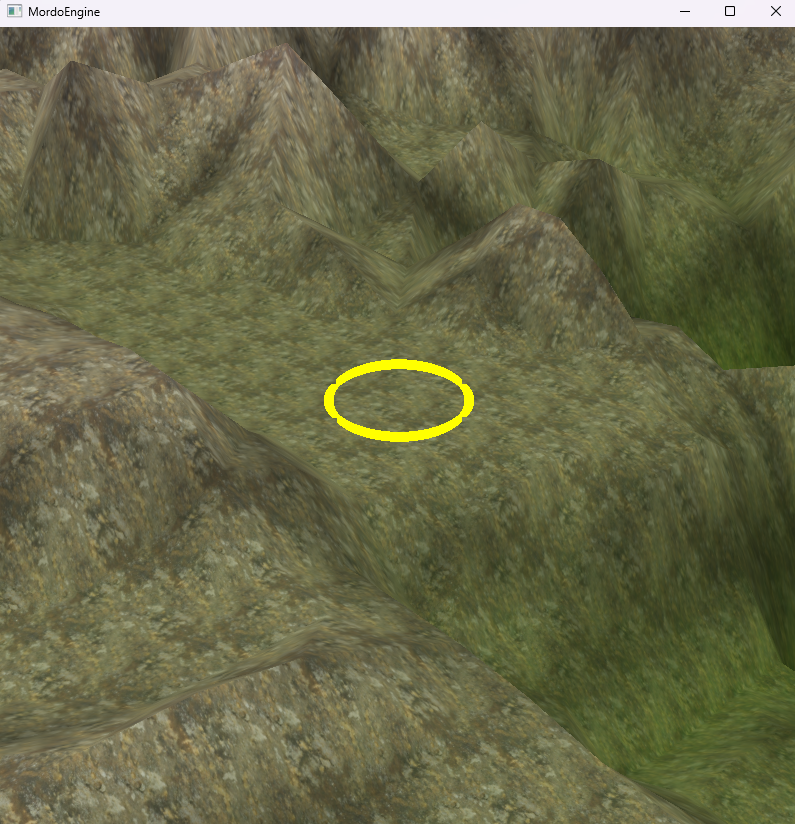
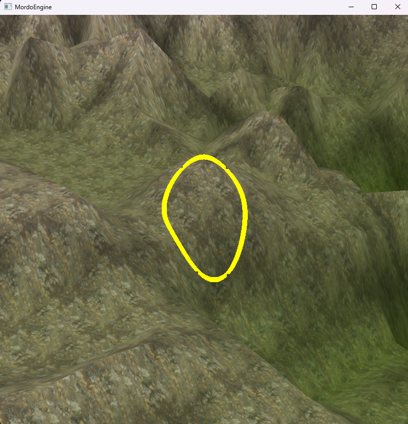

# 3D Engine & Game (C++ / OpenGL)

This repository documents my learning journey in **3D graphics and game engine development** using **C++ and OpenGL**.

The project focuses on building a **custom 3D graphics engine from scratch**, followed by the development of a **game built on top of that engine**.  
The codebase evolves over time as I learn new concepts, improve the architecture, and refactor existing systems.

## Goals (Current)
- Learn real-time 3D graphics programming
- Understand engine architecture and rendering pipelines
- Build a reusable 3D engine
- Create a game using the engine
- Document progress and learning over time

## Technologies
- C++
- OpenGL
- GLFW
- GLM
- glad
- stb_image
- perlin noise

## Project Status
Terrain Editor Preview, left click to raise terrain ( 7ms -> should be optimized in the future):

## Notes
This is an educational and personal project focused on learning and experimentation.  
Expect refactors, breaking changes, and incremental improvements as the project matures.
